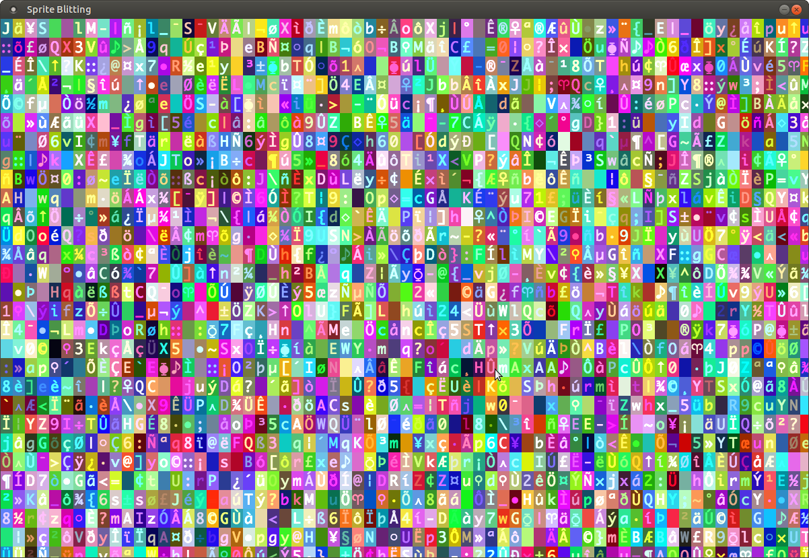

# Sprite Blitting Example in Zig

This code demonstrates how to use [Zig](https://ziglang.org) to call into the [SDL2](https://www.libsdl.org/) and [SDL2_image](https://www.libsdl.org/projects/SDL_image/) to perform sprite blitting.

* Load a spritesheet.
* Blit a sprite from the spritesheet onto a colored background.
* Use double buffering
* Tint the sprite before blitting.
* Clamp the render rate to once a second.

